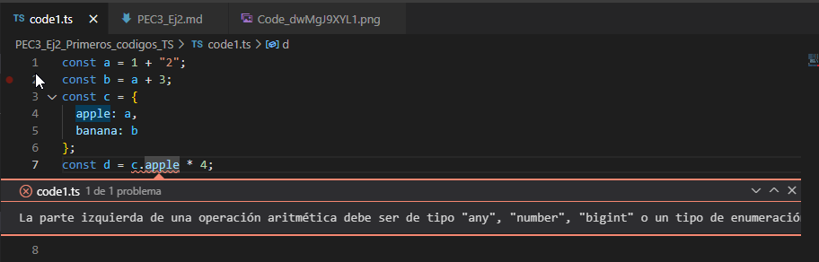
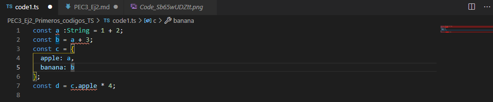

# PEC 3 Ejercicio 2
### 1 Programa sobre el fichero code1.ts realizando las siguientes tareas, deja comentarios en el código fuente sobre tus acciones
He modificado primer una de las dos partes de la variable a para hacerlo ser un String en lugar de un número

Luego he hecho el test forzando la variable a como String, con lo cual aun tenemos mas errores de inferencia de tipo

Esto es debído que a diferencia de javascript, ts tiene tipado de variables. Con esto vamos a poder minimizar problemas en ejecución con el tipo de las variables, descubriendolo antes de que se produjera en nuestra aplicación, cosa que no podríamos hacer en javascript.

### 2  Para cada uno de los valores del fichero code2.ts, ¿Qué tipo de datos inferirá TypeScript? Explica por qué se ha inferido este tipo de datos.

- __a__ Será campo de tipo `Number` por ser inicializada con un valor numérico
- __b__ y __c__ serán campos de tipo `string` por ser inicializadas con sendos valores de texto
- __d__ será un array de booleanos `boolean[]` ya que se a inicializado con un array de valores booleanos.
- __e__ será un objecto, con un campo llamado __type__ de tipo `string`
- __f__ es resuelto como un array. este array tendra opcionalmente tipos de datos diferentes, `boolean` o `Number`. Esto es debido a que el array ha sido inicializado con dos valores diferentes, uno numérico y otro booleano.
- __g__ dado que el valor se ha inicializado con un array con un tipo de datos numérico se infiere como un array numérico `Number[]`
- __h__ ya que esta inicializado a `null` typescript

### 3 ¿Por qué se dispara cada uno de los errores del fichero code3.ts?
- `i = 4;` Esta asignación da error ya que con anterioridad la _variable_ `i` ha sido declarada como constante `const i`. A una constante no se le puede asignar el valor después de asignarselo anteriormente. A demas, como nota personal, no entiendo muy bin lo de declararlo como `: 3`
- `j.push('5');` Estamos intentando insertar un valor de tipo texto en un array que ha sido inferido como array numérico `Number[]` por su declaración con `[1, 2, 3]`
- `let k: never = 4;` al tipo `never` no se le puede asignar un valor, el tipo `never` viene a indicar algo que no va a ocurrir nunca.
- `let m = l * 2;` el valor l ha sido declarado como `unknown`. Podemos decir que es parecido al tipo `any` pero es mucho mas restrictivo y tendremos que hacer checkings antes de poder utilizar su valor. Todas las asignaciones son correctas, es decir podemos asignar cualquier tipo a una variable `unknown` pero no podremos hacerlo al revés.

###  ¿Cuál es la diferencia entre una clase y una interface en TypeScript?
